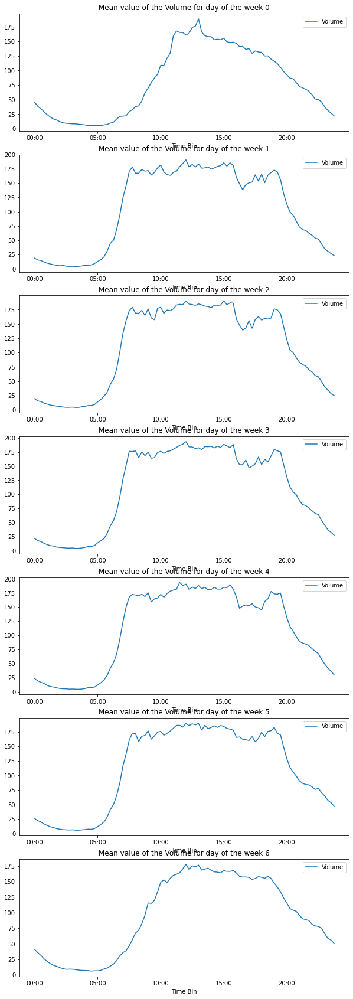
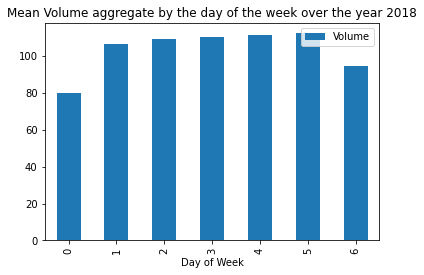
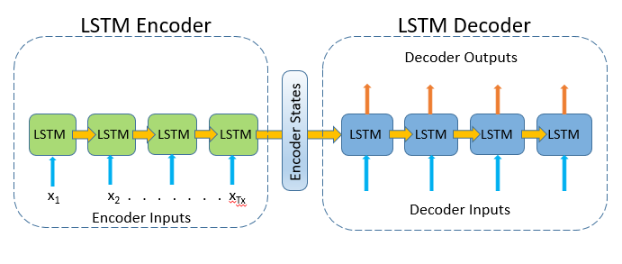
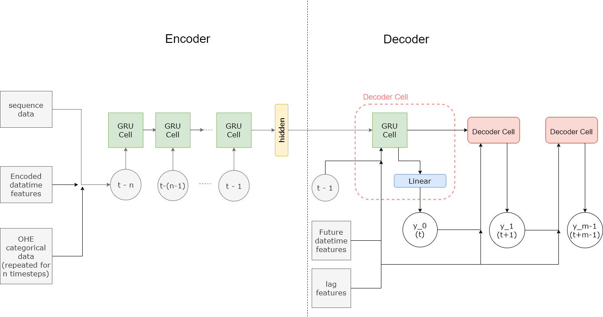

# Rapport Final - Machine Learning

Iris Dumeur & Clémence Vast

14/12/2020 - Ecole des Mines de Nancy

## Rappel des consignes
Data: Kaggle "Radar Traffic Data. Traffic data collected from radar sensors deployed by the City of Austin."
- Build a deep learning model that predicts the traffic volume.
- Do not use any other data source ! (in particular, no openstreetmap data...)
- If dataset too big for your laptop, reduce dataset size
- You may do it alone, or within a group of 2 (preferred)
- But you'll get an individual note !
- Score:
    - GIT (4): distribution of the workplan, individual contribution
    - REPORT (10): model(s), experimental process, citations
    - CODE (6): correctness, readability
- Use deep learning models
- Do not spend too much time on data pre-processing
- Most important: modeling, training, evaluating

## Introduction
Pour la construction de notre projet, nous avons procédé en plusieurs étapes : une première analyse des données, afin de comprendre leur construction et leur répartition, puis la mise en place d'un traitement de ces données pour créer des inputs de taille et de nature convenables pour prédire en série temporelle. Enfin, nous sommes passées à une grande phase d'expérimentation et nous avons choisi de tester plusieurs réseaux de deep learning, nous avons fait varier les paramètres ou hyperparamètres, nous avons joué sur le dataset et essayé de tirer des conclusions quant aux prédictions temporelles obtenues. Nos fonctions ou classes python principales sont organisées dans des fichiers .py et nos expérimentations dans des notebooks .ipynb. 

## Méthodes

### Analyse des données

Chaque radar fournit des données toutes les 15 minutes. Chaque nouvel apport de données par radar correspond à une ligne sur le CSV, incluant : 
 - le nom du radar
 - la position géographique du radar
 - la date et l’heure de soumission de données (sous différents formats)
 - la direction de circulation des voitures détectées
 - le nombre de voitures détectées

Décrire le nombre d'entités dans les colonnes

Décrire pourquoi on en supprime certaines

| Nom de la colonne | Description | Nombre d'entités | Remarques particulieres |
| ----------------- | ----------- |----------------- | ----------------------- |
| Location     | string, Nom du radar, un nom correspond à une localisation précise | 23  |    |
| location_latitude | latitude de la position du radar |    |    |
| location_logitude | logitude de la position du radar |    |    |
| Year | Année d'acquisition |    |    |
| Month | Mois d'acquisition |    |    |
| Day | Jours d'acquisition |    |    |
| Day of Week | Jours de la semaine, entier allant de de 0 à 6 |    |    |
| Direction | None, NB ou *** , indique la direction du passage des voitures compté par le radar |    |    |
| Volume| Nombre refletant le passage des voitures au niveau du radar entre deux instants|    |    |

Nous remarquons également des irrégularités pour des données, il est possible que certaines données manque. Ils existent de temps en temps pour un même radar, dans la même direction, à la même exacte heure deux données de volume différentes. Dans ce cas là nous sommerons les deux volumes obtenues. Par ailleurs, il peut arriver que les données manquent totalement sur une journée ou bien juste le temps d'une acquisition (il y aura alors une différence de 30 minutes entre deux acquisition). Travaillant avec des données temporelles, nous souhaitons avoir exactement le même échantillonage des données, ce qui nous menera à faire l'algorithme suivant de sélection des données : 

** Décrire l'algorithme, éventuellement, avec un schéma **

IMPORTANT Expliquer que volume est la variable d'intérêt, et quels autres variables pourraient servir comme feautures à ajouter ex: Day of the Week, Mois de l'année

#### Visualisation des données

Nous étudions ensuite les données pour un seul radar : ' CAPITAL OF TEXAS HWY / LAKEWOOD DR' en direction NB. Nous souhaitons rapidement, étudier une probable périodicité journalière des données d'une même année.  Nous remarquons pour les jours 0 et 6, l'évolution du volume moyen se distingue des jours 1,2,3, 4 et 5. Ainsi il paraît important de transmettre des informations sur le jour de la semaine au réseaux de neurones. 

Ensuite nous nous intéressons au volume moyen, par jour de la semaine, détecté par le radar CAPITAL OF TEXAS HWY / LAKEWOOD DR en direction NB, sur l'année 2018. 

On agrège les données ayant la même exacte date d'acquisition.
**insérer graph de image repertoire**
**Analyser graph de image repertoire**

#### Préparation des datasets

Le traitement des données a été fait de manière à pouvoir choisir la taille des données (input) en entrée et à prédire (label). Les différentes possibilités de construction de dataset, nous mènent à attribuer un identifiant pour chaque dataset construit. Nous utiliserons cette notation lors de la présentation des résultats. Puisque nous ne possédions pas de ressource type gpu pour entrainer nos réseaux de neurones, nous avons délibéremment choisit de ne pas construire des datasets avec une forte variabilité de données : selection de données provenant d'un seul radar, de la même année, d'une même direction. 

| Identifiant du dataset | Nombre de radar | Direction | Taille total du dataset   | Taille input x en jour | Taille label y  |
| ----------------- |  ----------------- | ----------- | ----------- | ----------- | ----------- |
| Dataset0 | 1 | 1 | 1 an (2018) | 7 jours de données | 1 jours de données|
|  |  |  | 1 an (2018) | 7 jours de données | 7 jours de données |
|  |  |  | ** | 1 mois de données | 1 semaine de données |
|                        |                 |           |                         |                        |                      |

Puisque nous ne possédions pas de ressource type gpu pour entrainer nos réseaux de neurones, nous avons délibéremment choisit de ne pas construire des datasets avec une forte variabilité de données : selection de données provenant d'un seul radar, de la même année.  

De plus comme 

### Réseaux de neurones utilisés

#### LSTM-simple

Le premier modèle repose sur le module LSTM  (je vais essayer de faire cette partie - clem)

Inclure description schéma

Hyper-paramètres qu'on a choisit

ce modèle a été facile à implémenter et à tester, cependant il manque de finesse. Tout d'abord l'inclusion de features n'est pas prévu. 

#### Encoder-decoder

Nous avons cherché à étudier un second modèle encodeur décodeur ou *seq2seq* qui correspond à la concaténation de deux modèles : 

- un modèle encodeur qui encode une séquence en un vecteur de longueur fixe. Ce modèle est constitué d'une succession de blocs récurent, dans notre cas des blocs LSTM. Chaque "bloc" prend en entrée un élément de la séquence et le propage. Le *hidden state* est calculée de la manière suivant 

  $h_t=f(W^{(hh)}h_{t-1})$

  

- un modèle décodeur qui décode un vecteur de longueur fixe et prédit une séquence

La transmission entre 

Un second modèle a été implémenté pour pouvoir répondre aux problèmes précédents. Connu pour son utilisation et son efficacité lors du traitement de time series, AJOUTER QQL SOURCES

Le modèle lstm encoder-decoder repose l'association de deux modèles : encoder/decoder. 

[Image de *Video Prediction using Deep Learning and PyTorch (-lightning)* article](https://towardsdatascience.com/video-prediction-using-convlstm-with-pytorch-lightning-27b195fd21a2)

Le modèle encoder est similaire au modèle LSTM-simple. Pour le décodeur, pour chaque du vecteur en sortie de la séquence

Expliquer le principe du teacher forcing

##### Ajout de features

[Image de l'article *Encoder-Decoder Model for Multistep Time Series Forecasting Using PyTorch*  provenant de Towardsdatascience](https://towardsdatascience.com/encoder-decoder-model-for-multistep-time-series-forecasting-using-pytorch-5d54c6af6e60)

#### Bayesian LSTM

Nous avons choisi d'explorer la piste d'une prédiction rendue sous forme d'un interval de confiance plutôt qu'une valeur.  Le model LSTM Bayésien (mis à disposition par la bibliothèque BLiTZ) propose, en plus de l'architecture LSTM, d'utiliser la distribution de probabilité au lieu de poids "déterministes". Il s'agit ensuite d'optimiser ces paramètres de distribution.

Le modèle choisi a été inspiré des travaux de Piero Esposito, principalement décrits ici : https://towardsdatascience.com/bayesian-lstm-on-pytorch-with-blitz-a-pytorch-bayesian-deep-learning-library-5e1fec432ad3 .

Pour des couches de neurones non-bayesiennes, nous avons généralement pour équation non-linéaire :

Les couches de neurones bayesiennes ont pour but d'introduire une incertitude sur les poids pour chaque opération forward. En mesurant la dispersion, la couche bayésienne permet de rassembler les différentes incertitudes pour les prédictions du modèle par rapport à un point donné du dataset.

Pour chaque opération forward, il est nécessaire d'échantillonner les paramètres (W les poids et b les biais). Les équations utilisées pour cet échantillonnage sont définies ci-dessous :

où **ρ** représente l'écart-type et  **μ** représente la moyenne des échantillons.

On utilise le mean square error loss et à la dérivabilité de celui ci. Pour chaque mouvement forward, le coût est calculé, pour chaque couche bayésienne. La somme des coûts de chaque couche bayésienne est ajoutée au loss.

Expliquer ici mes fonctions rapide

#### Métriques utilisées, mesure de la qualité de la performances de l'algorithme

Nous avons utilisé le Mean Square Error comme fonction de loss dans notre

Pour le bayesian lstm, je parlerai de mon loss (mse et sampler) dans ma partie - clem

## Résultats

Nos ressources en calcul étant limité, nous sommes conscient que nous avon souvent pratiqué de "early stopping", car nous ne pouvions pas forcément nous permettre de passer autant de temps à entrainer un réseau de neurones.

## Résultats et analyse

## Conclusion

