# Rapport Final - Machine Learning

Iris Dumeur & Clémence Vast

14/12/2020 - Ecole des Mines de Nancy

## Rappel des consignes
Data: Kaggle "Radar Traffic Data. Traffic data collected from radar sensors deployed by the City of Austin."
- Build a deep learning model that predicts the traffic volume.
- Do not use any other data source ! (in particular, no openstreetmap data...)
- If dataset too big for your laptop, reduce dataset size
- You may do it alone, or within a group of 2 (preferred)
- But you'll get an individual note !
- Score:
    - GIT (4): distribution of the workplan, individual contribution
    - REPORT (10): model(s), experimental process, citations
    - CODE (6): correctness, readability
- Use deep learning models
- Do not spend too much time on data pre-processing
- Most important: modeling, training, evaluating

## Introduction
Pour la construction de notre projet, nous avons procédé en plusieurs étapes : une première analyse des données, afin de comprendre leur construction et leur répartition, puis la mise en place d'un traitement de ces données pour créer des inputs de taille et de nature convenables pour prédire en série temporelle. Enfin, nous sommes passées à une grande phase d'expérimentation et nous avons choisi de tester plusieurs réseaux de deep learning, nous avons fait varier les paramètres ou hyperparamètres, nous avons joué sur le dataset et essayé de tirer des conclusions quant aux prédictions temporelles obtenues. Nos fonctions ou classes python principales sont organisées dans des fichiers .py et nos expérimentations dans des notebooks .ipynb. Une fonction main.py permet d'ouvrir les data, lancer le processing de son choix, entrainer le modèle, ajuster les paramètres.

## Méthodes

### Analyse des données

Chaque radar fournit des données toutes les 15 minutes. Chaque nouvel apport de données par radar correspond à une ligne sur le CSV, incluant : 
 - le nom du radar
 - la position géographique du radar
 - la date et l’heure de soumission de données (sous différents formats)
 - la direction de circulation des voitures détectées
 - le nombre de voitures détectées

| Nom de la colonne | Description | Nombre d'entités | Remarques particulieres |
| ----------------- | ----------- |----------------- | ----------------------- |
| Global date | Dates et heures détaillées | 71599 |  |
| Location     | string, Nom du radar, un nom correspond à une localisation précise | 23  |    |
| location_latitude | latitude de la position du radar | 18 |    |
| location_longitude | longitude de la position du radar | 18 |    |
| Year | Année d'acquisition | 3 |    |
| Month | Mois d'acquisition | 12 |    |
| Day | Jours d'acquisition | 31 |    |
| Day of Week | Jours de la semaine, entier allant de de 0 à 6 | 7 |    |
| Direction | ['None', 'NB', 'SB', 'EB', 'WB'] indique la direction du passage des voitures compté par le radar | 5 |    |
| Volume| Nombre refletant le passage des voitures au niveau du radar entre deux instants| 256 |    |

La variable que nous chercherons à prédire est Volume car elle reflète le nombre de voiture qui passent devant le radar entre deux instants et est utile pour prédire la circulation au sein de la ville. 

Nous remarquons également des irrégularités pour des données. Par exemple, ils existent également de temps en temps pour un même radar, dans la même direction, à la même exacte heure deux données de volume différentes. Dans ce cas là, nous sommerons les deux volumes obtenues. Par ailleurs, il peut arriver que les données manquent totalement sur une journée ou bien juste le temps d'une acquisition (il y aura alors une différence de 30 minutes entre deux acquisitions). Travaillant avec des données temporelles, nous souhaitons avoir exactement le même échantillonage des données. Nous serons ainsi amené lors de la construction de nos batch de données à remplacer par 0 la valeur d'une donnée si elle est absente, de manière isolée, ou alors supprimer complètement le batch dépendant d'un jour sans données. L'ensemble de nos fonction gérant l'analyse et la construction des datasets est contenu dans open_data.py.

#### Visualisation des données

Nous étudions ensuite les données pour un seul radar : ' CAPITAL OF TEXAS HWY / LAKEWOOD DR' en direction NB. Nous souhaitons rapidement, étudier une probable périodicité journalière des données d'une même année.

Ensuite nous nous visualisons au volume moyen, par jour de la semaine, détecté par le radar CAPITAL OF TEXAS HWY / LAKEWOOD DR en direction NB, sur l'année 2018. 

 Nous remarquons pour les jours 0 et 6 (respectivement samedi et dimanche), l'évolution du volume moyen se distingue des autre jours de la semaine 1,2,3, 4 et 5. Ainsi il paraît important de transmettre des informations sur le jour de la semaine au réseaux de neurones.  

#### Préparation des datasets

Le traitement des données a été fait de manière à pouvoir choisir la taille des données (input) en entrée et à prédire (label). Les différentes possibilités de construction de dataset, nous mènent à attribuer un identifiant pour chaque dataset construit. Nous utiliserons cette notation lors de la présentation des résultats. Puisque nous ne possédions pas de ressource type gpu pour entrainer nos réseaux de neurones, nous avons délibérément choisit de ne pas construire des datasets avec une forte variabilité de données : sélection de données provenant d'un seul radar, de la même année, d'une même direction. 

| Identifiant du dataset | Nombre de radar | Direction | Ecart maximale entre les données | Taille input x en jour | Taille label y  | Taille totale du dataset |
| ----------------- |  ----------------- | ----------- | ----------- | ----------- | ----------- | ----------- |
| Dataset0 | 1 | 1 | 1 an (2018) | 7 jours de données | 1 jours de données| |
| Dataset1 | 1 | 1 | 4 mois (début 2018) | 7 jours de données | 1 jours de données | 42 |

La construction des Dataset0 et Dataset1 est poussée par le fait qu'il semble y avoir une certaine répétitivité du phénomène par semaine. Ainsi on peut présumer que connaître la variation du volume de voiture pour ce radar la semaine d'avant le jour de prédiction nous aidera grandement. 

Enfin à partir ce ces datasets, juste avant l'entrainement nous les diviserons en trois sous datasets : entrainement, validation et test avec respectivement 80% , 5% et 15% des données.

| Nom du dataset | Role                                                         |
| -------------- | ------------------------------------------------------------ |
| Entrainement   | Données sur lequel est entrainé le réseau de neurones        |
| Validation     | Permet de régler le choix des hyperparamètres du réseau de neurones |
| Test           | Données permettant d'établir les performances du modèle      |

### Réseaux de neurones utilisés

#### LSTM-simple

Le premier modèle repose sur le module LSTM  (je vais essayer de faire cette partie - clem)

Inclure description schéma

Hyper-paramètres qu'on a choisit

ce modèle a été facile à implémenter et à tester, cependant il manque de finesse. Tout d'abord l'inclusion de features n'est pas prévu. 

#### LSTM Encoder-decoder

Nous avons cherché à étudier un second modèle encodeur décodeur ou *seq2seq* qui correspond à la concaténation de deux modèles : un modèle encodeur et un modèle décodeur. Nous nous sommes inspirés de l'implémentation sous pytorch du modèle [lstm_encoder_decoder](https://github.com/lkulowski/LSTM_encoder_decoder/blob/master/code/lstm_encoder_decoder.py) développé par Ikulowski sur disponible sur github.

[Image de *Video Prediction using Deep Learning and PyTorch (-lightning)* article](https://towardsdatascience.com/video-prediction-using-convlstm-with-pytorch-lightning-27b195fd21a2)

##### Modèle encodeur

Le modèle encodeur encode une séquence en un vecteur de longueur fixe. Ce modèle est constitué d'une succession de blocs récurent, dans notre cas des blocs LSTM. Chaque "bloc" prend en entrée un élément de la séquence et le propage. Le *hidden state* à chaque t est calculée de la manière suivante: 

Le *hidden state* final, à la sortie du dernier blocs LSTM, est un vecteur qui encapsule des informations provenant de tous les éléments de la séquence d'entrée et aidera le décodeur à prédire de manière précise la séquence de sortie.

Le *hidden state* de sortie de l'encodeur correspondra à au *hidden state* en entrée du modèle de décodeur.  

##### Modèle décodeur

Le modèle décodeur décode un vecteur de longueur fixe et prédit une séquence. Ce modèle est constitué d'une succession de blocs, un bloc par élément à prédire. Chaque bloc prend en entrée le *hidden state*, ainsi que la prédiction du bloc précédent et produit un *hidden state* ainsi qu'une prédiction. 

##### Teacher forcing

Il peut être difficile d'entrainer un modèle *seq2seq*, car initiallement les prédictions faites par chacun des blocs du décodeur sont non précises, et sont prises en compte pour la prédiction du blocs suivant. 

Pour faciliter la convergence du modèle lors de l'entrainement, la méthode de *teacher forcing* peut être utilisé.  Au sein du décodeur, au lieu d'utiliser la prédiction du blocs précédent (prédiction à t-1) pour calculer une sortie à t, la valeur de la vérité terrain à t-1 est utilisée. 

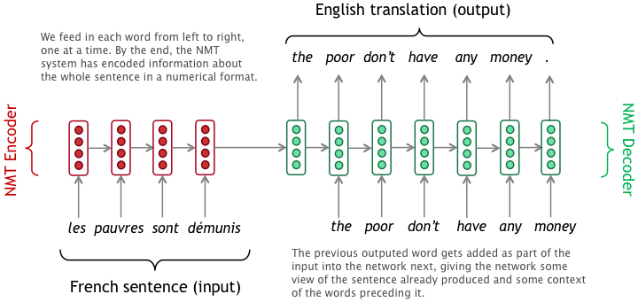

[Translation or Answering tool: seq2seq with teacher forcing and attention mechanism](https://medium.com/@vivekvscool/translation-or-answer-tool-seq2seq-with-teacher-forcing-and-attention-mechanism-7cfd9cb03b3a)

##### Ajout de features

Pour le moment tous les modèles que nous avons choisit ne prennent qu'en entrée les données *Volumes* temporelles du jeux de données. Il existent des modèles encodeur-décodeur où il est possible d'ajouter des features afin de rendre les prédictions plus précises. 

Par exemple, nous avons remarqué lors de l'analyse des données que le Volume de voiture variait en fonction du jour de la semaine. Ainsi rajouter ces informations lors du features d'entrée pourraient améliorer la précision du modèle. 

En ajoutant des features,  comme le jour de la semaine, il sera par exemple probablement possible de diminuer la taille des données d'entrée (en nombre de données temporelles).  Il est également possible de penser qu'avec un modèle prenant en compte les features, le modèle pourra s'entrainer et prédire correctement sur des données provenant de radar différents, si la variable qualitative *nom du radar* est pris en compte en entrée du réseau. 

[Image de l'article *Encoder-Decoder Model for Multistep Time Series Forecasting Using PyTorch*  provenant de Towardsdatascience](https://towardsdatascience.com/encoder-decoder-model-for-multistep-time-series-forecasting-using-pytorch-5d54c6af6e60)

#### Bayesian LSTM

##### Le principe des couches bayésiennes

Nous avons choisi d'explorer la piste d'une prédiction rendue sous forme d'un interval de confiance plutôt qu'une valeur.  Le model LSTM Bayésien (mis à disposition par la bibliothèque BLiTZ) propose, en plus de l'architecture LSTM, d'utiliser la distribution de probabilité au lieu de poids "déterministes". Il s'agit ensuite d'optimiser ces paramètres de distribution.

Le modèle choisi a été inspiré des travaux de Piero Esposito, principalement décrits ici : https://towardsdatascience.com/bayesian-lstm-on-pytorch-with-blitz-a-pytorch-bayesian-deep-learning-library-5e1fec432ad3 .

Pour des couches de neurones non-bayesiennes, nous avons généralement pour équation non-linéaire :

Les couches de neurones bayesiennes ont pour but d'introduire une incertitude sur les poids pour chaque opération forward. En mesurant la dispersion, la couche bayésienne permet de rassembler les différentes incertitudes pour les prédictions du modèle par rapport à un point donné du dataset.

Pour chaque opération forward, il est nécessaire d'échantillonner les paramètres (W les poids et b les biais). Les équations utilisées pour cet échantillonnage sont définies ci-dessous :

où **ρ** représente l'écart-type et  **μ** représente la moyenne des échantillons.

On utilise le mean square error loss et à la dérivabilité de celui ci. Pour chaque mouvement forward, le coût est calculé, pour chaque couche bayésienne. La somme des coûts de chaque couche bayésienne est ajoutée au loss.

##### L'implémentation sous Pytorch

Les paramètres à entrainer dans notre cas sont ρ et μ, afin de déterminer la distribution en probabilité des poids. Pour construire le modèle LSTM bayésien, nous utilisons la bibliothèque BLiTZ, qui possède un objet couche BayesianLSTM tout prêt. 

Nous importons cette couche bayésienne ainsi qu'un décorateur *@variational_estimator* qui permet de conserver les différents échantillonnages du modèle bayésien et leurs coûts. Le modèle est construit sur la base que nous avions utilisé pour le LSTM simple, avec un changement au niveau de la couche LSTM de pytorch, substituée par une couche BayesianLSTM et adaptée à la syntaxe de BLiTZ.

La fonction train est également adaptée, et on y rajoute une méthode *"sample_elbo"* qui permet de calculer le changement des paramètres et le loss du training pour divers échantillons (nombre d'échantillons choisi manuellement).

Enfin, pour la phase de test (modèle entraîné) les prédictions du modèle sont aussi calculées pour les différents échantillons. Les prédictions et paramètres ρ et μ du modèle nous permettent de calculer des bornes et une moyenne pour chaque valeur prédite, à l'aide de la fonction implémentée *get_confidence_intervals*.

Cette fonction calcule les bornes et la moyenne ainsi, avec le coefficient de confiance CI multiplier :

    pred_mean = preds_test.mean(0)
    pred_std = preds_test.std(0).detach().cpu().numpy()
    
    pred_std = torch.tensor((pred_std))
    
    upper_bound = pred_mean + (pred_std * ci_multiplier)
    lower_bound = pred_mean - (pred_std * ci_multiplier)

On obtient aussi des prédictions dont la certitude est exprimée pour la phase de test.

#### Métriques utilisées, mesure de la qualité de la performances de l'algorithme

Nous avons utilisé le Mean Square Error comme fonction de loss dans notre

Pour le bayesian lstm, je parlerai de mon loss (mse et sampler) dans ma partie - clem

## Résultats

Nos ressources en calcul étant limité, nous sommes conscient que nous avons de temps en temps pratiqué l'*early stopping*, car nous ne pouvions pas forcément nous permettre de passer autant de temps à entrainer un réseau de neurones.

### LSTM simple

Nous avons entrainé le model simple sur le Dataset0 décrit précédemment en faisant varier le learning rate    entre les valeurs suivantes : 0.05, 0.001 et 0.01.

En étudiant la variation de loss pour ces différents learning rate, nous avons remarqué que l'entrainement ne semble converger que pour un learning rate de 0.001.

Lors de l'entrainement du modèle LSTM simple, avec  un learning rate de 0.001 et pour 700 epochs, nous obtenons l'évolution de la loss mse suivante. 

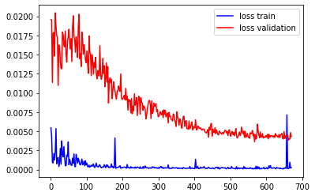

​													*Variation de la loss pour LSTM simple*

Nous avons également visualisé les prédictions effectué par ce modèle :

 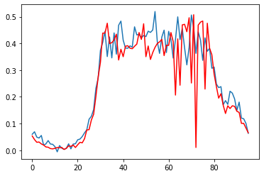  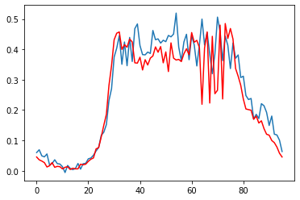

​			<u>Prédictions simple-model LSTM sur le dataset de test de Dataset0</u>

### Encodeur-décodeur

L'entrainement de ce réseau de neurones a été particulièrement difficile et couteux en temps. L'entrainement étant long, nous avons travaillé avec un petit dataset pour ce réseau : le Dataset1, décrit dans la section *préparation des datasets*. 

Avec une méthode de *teacher forcing*, un learning rate à 0.001, la dimension de *hidden state* de 64 et 300 epochs d'entrainement les prédictions en test obtenus sont les suivantes : 

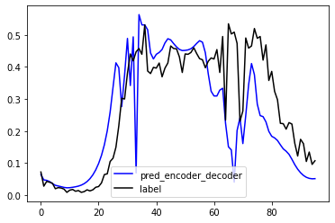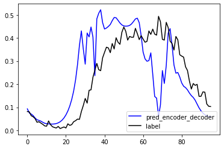

​								<u>Prédictions de encoder-decoder sur le dataset de Test de dataset1</u> 

Puisque les résultats sans features n'étaient pas satisfaisant et le temps d'entrainement lent (30 minutes pour 100 epochs) , nous n'avons pas cherché à complexifier le modèle avec des features et à l'entrainer.
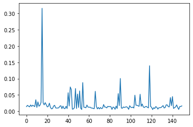

​		<u>Évolution de la loss sur le dataset de validation lors de l'entrainement du modèle encodeur-décodeur</u>

Puisque les résultats sans features n'étaient pas satisfaisant et le temps d'entrainement lent ( jusqu'à 40 minutes pour 300 epochs) , nous n'avons pas cherché à complexifier le modèle avec des features et à l'entrainer.

### Bayesian LSTM

Pour le modèle LSTM bayesien, le modèle sélectionné a été entrainé avec les paramètres et hyperparamètres suivants :

| Paramètre/hyperparamètre | Valeur                                                       |
| ------------------------ | ------------------------------------------------------------ |
| Input_dim                | 7 jours x 24 x 4 (nombre de valeurs relevées par le radar pour 7 jours) |
| Hidden_dim               | 70                                                           |
| Output_dim               | 1 jour x 24 x 4 (nombre de valeurs à prédire pour 1 jour)    |
| Learning rate            | 0.001                                                        |
| Nb of epochs             | 100                                                          |

Les 100 epochs prennent environ 3 minutes pour ce modèle et nous pourrions envisager d'entrainer un peu plus longtemps ou en faisant varier l'hidden_dim pour prendre en compte plus de features. L'entrainement de 700 epochs testé n'ayant pas apporté de précisions beaucoup plus flagrantes, nous avons décidé de continuer avec 100 epochs pour ce modèle.

La particularité de la méthode sample_elbo utilisée dans le train construit des valeurs de loss_train très élevées, mais qui diminuent au fil des itérations.

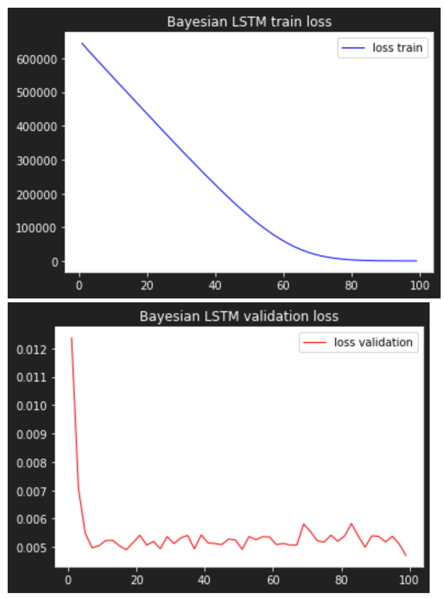

On remarque également que le loss de la validation diminue fortement mais reste un peu instable par la suite. Essayer de faire tourner ce modèle sur des datasets différents pourrait potentiellement donner des résultats un peu meilleurs, même si l'allure générale de l'évolution du loss démontre déjà un certain apprentissage effectué.

Les résultats sont intéressants du fait de la visualisation du l'intervalle de confiance calculé :

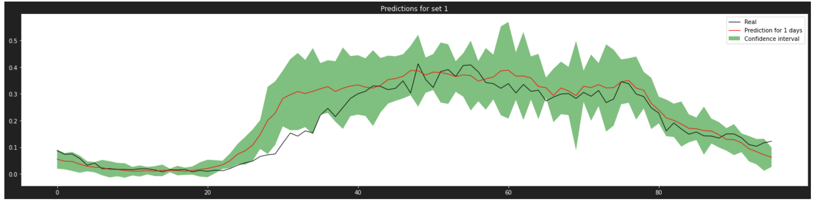

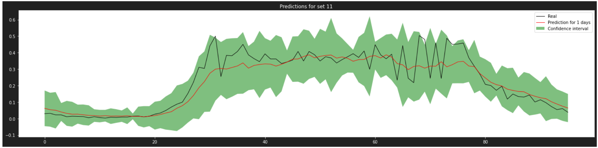

### 

## Discussion

Puisque nous ne possédions pas de ressources réellement suffisantes nous sommes conscient que les résultats ne sont pas réellement représentatifs de ce que ces modèles pourrait prédire en réalité. Par exemple, les performances décevantes du modèle encodeur décodeur peuvent s'explique par le faible nombre d'epoch utilisé pour l'entrainement. De plus, le temps d'entrainement des réseaux limitent également la recherche d'hyper-paramètre. Quelques essais de variations du learning rate ont été fait, mais il aurait pu être intéressant pour chaque modèle de faire varier le taille du vecteur *hidden state* et  le nombre de couche LSTM utilisé. 

### Jeux de données

Nous avons eu des difficulté à entrainer le réseaux de neurones du fait de notre grand nombre de données et faible capacité de nos ordinateurs. Comme nous avions remarqué une certaine répétitive de la variable volume de manière hebdomadaire, il aurait pu être intéressant d'utiliser plutôt uniquement les données à Jour-7 pour prédire au Jours J, ou même J-14, J-7 pour prédire au jour J. 

### Simple LSTM model

L'étude de la variation de loss pour le simple LSTM model, montre bien un phase d'aprentissage. Nous avons une décroissance de la loss pour le dataset de train et de validation avec l'atteinte d'un potentiel plateau.

De plus, l'observation des prédictions montre une certaine cohérence avec la vérité terrain. Cependant, la valeur de la loss dans le dataset d'entrainement étant bien plus faible que pour le dataset de validation.  La visualisation des prédictions sur les données d'entrainement ne montre pas cependant une situation d'overfitting. 

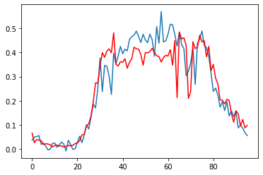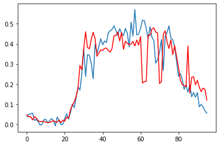

<u>Prédictions de simple_model sur le dataset de train du dataset0</u>

Il aurait peut être été interessant de laisser l'entrainement se faire sur un plus grande nombre d'epoch. 

### Encodeur-décodeur

Les résultats obtenus avec le modèle encodeur-decodeur actuel ne sont pas réellement satisfaisant, puisque non représentatif de la réalité. L'étude de la variation de la loss sur le dataset de validation montre bien un soucis dans l'entrainement :  il n'y a pas de phénomène de décroissance de la loss. 

Les causes de ces mauvaises performances peuvent être l'arrêt trop tôt de l'entrainement ou *early stopping*empéchant le modèle de converger ou un mauvais réglage des hyperparamètres. 

## Conclusion

Le modèle idéal : prend en information : jour de la semaine, vacances scolaires, jours férié, mois de l'année, le nom du radar, la direction et donne le résultat. 